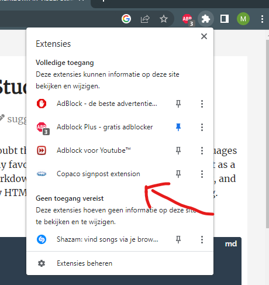
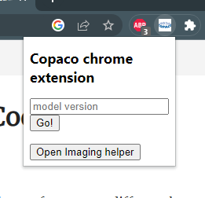
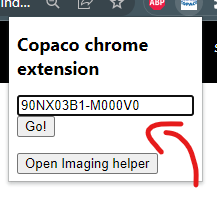
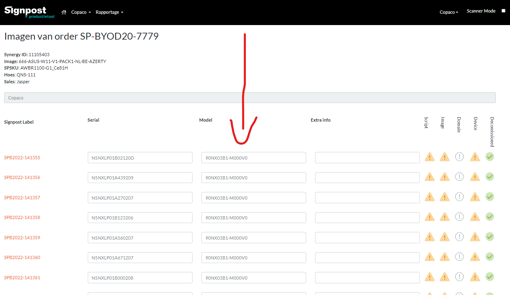
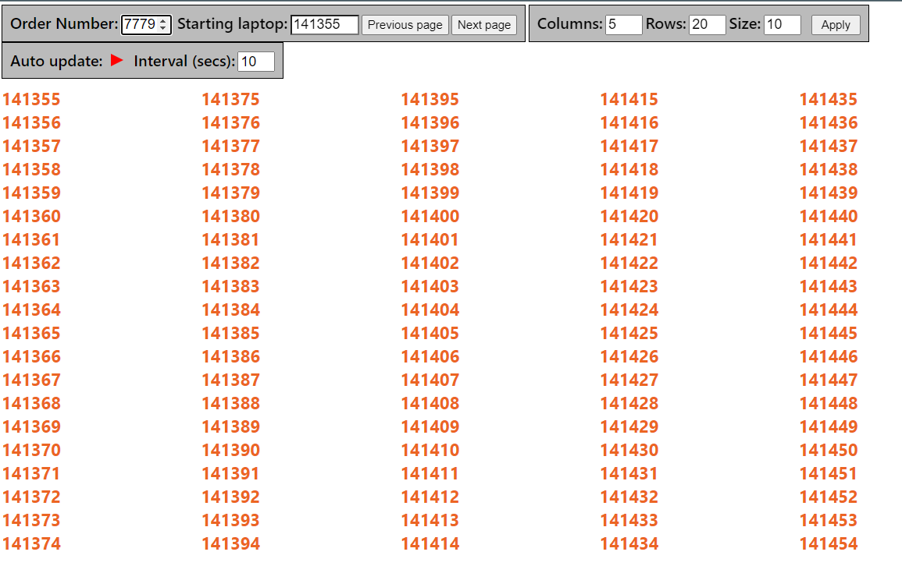
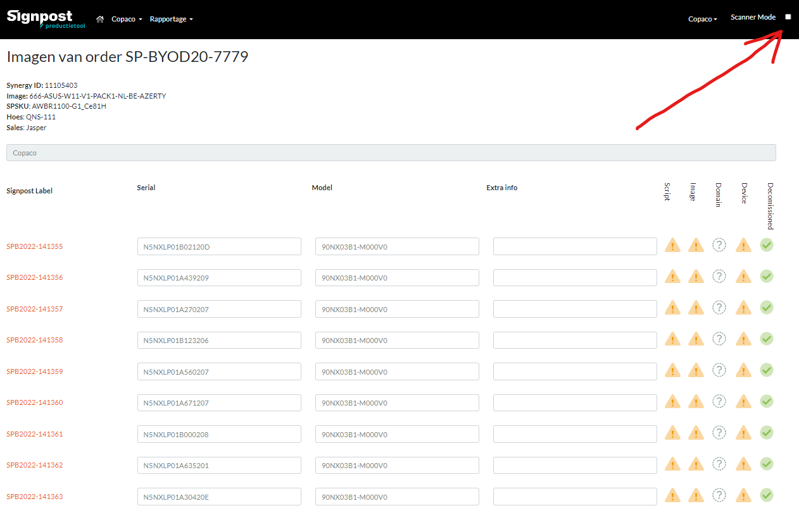
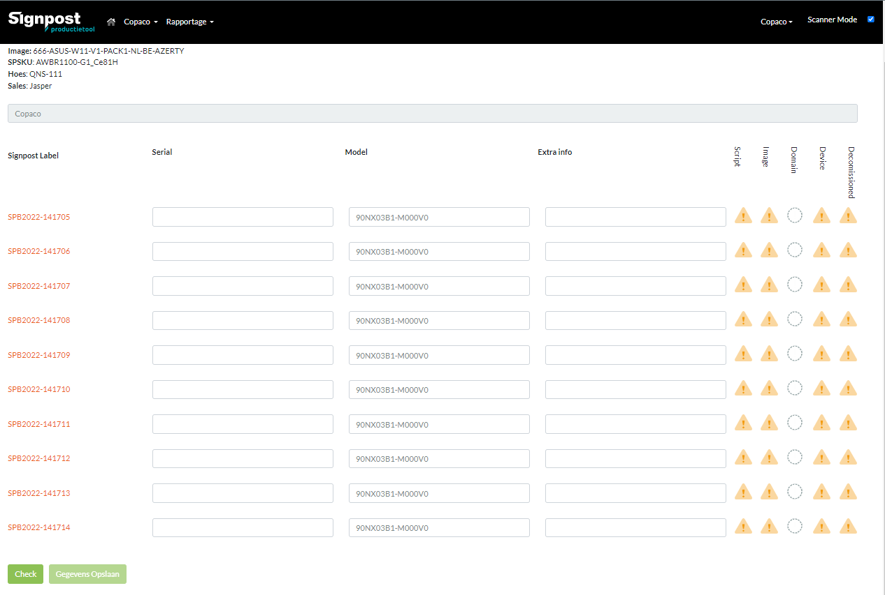
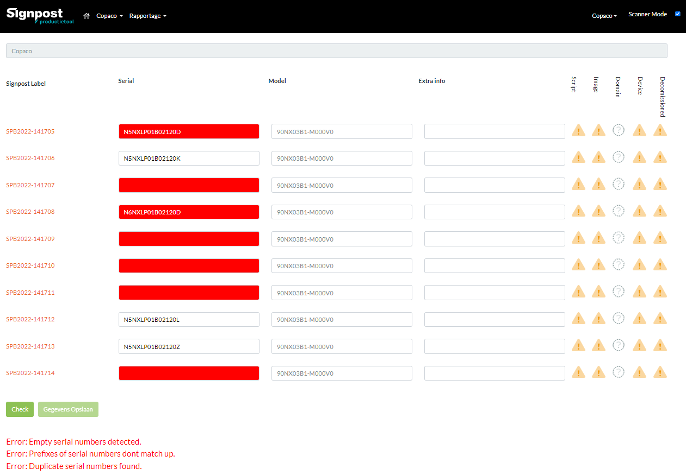
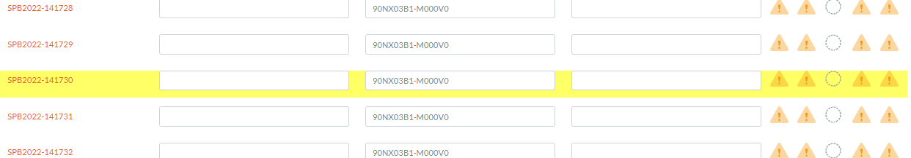

<<<<<<< HEAD
# copaco-signpost-extension

## Install guide

1. Select the latest production branch in the dropdown list in the top left corner. (production-v10)
2. Click on the green Code button.
3. Click on download ZIP
4. Go to downloads folder and move the downloaded zip to the Desktop.
5. unzip it.
6. Open a new chrome tab and type in the url bar: chrome://extensions and hit enter.
7. Turn on developer mode (ontwikkelaarsmodus in dutch).
8. Click on load unpacked extension (Uitgepakte extensie laden in dutch)
9. Choose the folder of the unzipped extension

It should now work.
if it does not work try closing down all chrome tabs and boot it up again.

## Features
The copaco signpost extension has 3 features namely the Model version paster, Imaging helper and Scanner mode. The first two can be accessed by opening the extension popup by clicking on the puzzle piece in Google chrome. 

If u click on the extension the popup as shown below wil open.

Clicking on "Open imaging helper" will open the imaging helper.

## Model version paster

This feature pastes the same model version in all the "Model" input fields on the Signpost imaging page of an order. 

To do this you must first input the desired model number in the input field as shown below. CLick on "Go!" to paste.

The desired model number is now pasted in all the "Model" input fields of the page as shown below.

## Imaging helper

The Imaging helper is used to display the status of each laptop during the imaging process of a Signpost order. This is done by displaying the SPB label of each laptop. If the number is green the laptop is done imaging. If it is red it is not yet finished.

An Signpost order can be loaded by inputting the order number in the "Order number" input field and pressing enter.

The imaging helper can refresh the laptop statusses automatically. This can be enabled by hitting the play symbol next to the "Auto update" text. This will start refreshing the laptop statusses every few seconds which can be adjusted with the "Interval (secs)" input field.

You can choose the starting laptop with the "Starting laptop" input field. The starting laptop is the first laptop for which its SPB label appears on screen.

The "Columns", "Rows" and "Size" input fields can be used to adjust the way the SPB labels appear on the screen.

## Scanner mode

The Scanner mode feature helps the preconfig employee with scanning the serial numbers of unpacked laptops. It can be enabled by hitting the checkbox as shown in the image below.

When enabled the scanner mode hides all input fields except for the 10 laptops which are next up. This prevents having to scroll down the page everytime you want to scan the current batch. 

Before the changes can be saved, the new serial numbers must be validated. The scanner mode checks for duplicates and if the serial number has the right prefix. The "Check" button must be clicked to do this. Serial numbers which are not valid will be marked red. The corresponding errors are shown in the bottom.

Every 75th laptop is marked yellow as shown below. This can be used as a reminder that this is the laptop of which the adapter is the last one in the current adapter box.

## Code explanation

This application is an chrome extension. This means that it will only run in Google Chrome and other browsers which support Chrome extensions. It is only tested in Google Chrome.

The production-v10 branch is the latest production branch and should be used to install the application. The master branch does uses mocked data for the Imaging helper.

**manifest.json** This json file is used by the chrome browser to load in the extension.

**content.js** - This script runs within the context of a specific chrome tab. it is executed when the page is loaded. This script contains the code for the Scanner mode and Model version paster features.

**imaging_helper.js** This script contains the functionality of the Imaging helper feature.

**scraper.js** This script scrapes information from the signpost order html page. The scraped data is used in the Imaging helper to display the status of all the laptops in the order.

**background.js** This script runs when the chrome browser is booted up. This script keeps track of wheter the scanner mode is enabled for the Scanner mode feature.

**popup.html/popup.js** These files are used for the popup where you can open the imaging helper and use the Model version paster feature.

**test files** This folder contains two Signpost order pages which can be used to manually test the application if you have no permission to the signpost order page.

=======
# copaco-model-version-extension

## Install guide

1. Click on the green Code button.
2. Click on download ZIP
3. Go to downloads folder and move the downloaded zip to the Desktop.
4. unzip it.
5. open a new chrome tab and type in the url bar: chrome://extensions and hit enter.
6. turn on developer mode (ontwikkelaarsmodus in dutch).
7. Click on load unpacked extension (Uitgepakte extensie laden in dutch)
8. Choose the folder of the unzipped extension

It should now work.
if it does not work try closing down all chrome tabs and boot it up again.
>>>>>>> 1c62d267370281cbe018ec03cf77c417cdcf3c11
